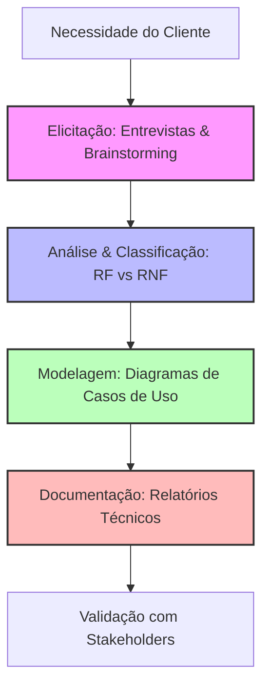
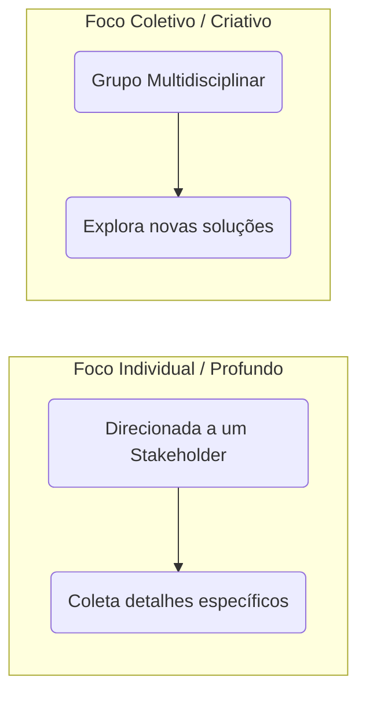
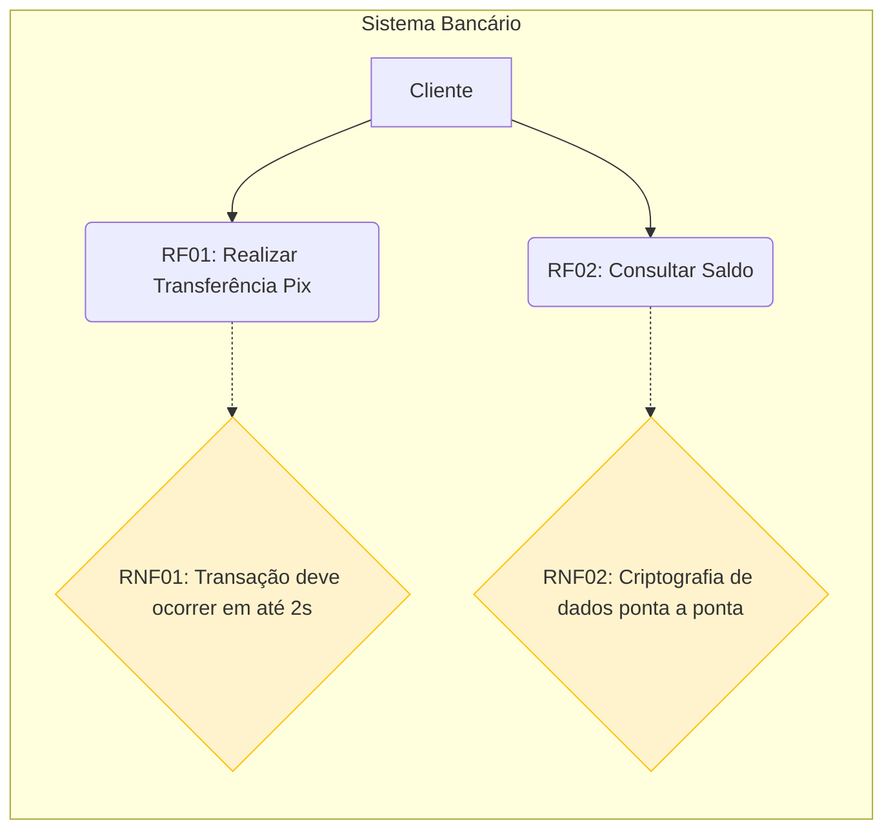

# 📋 Curso: Engenharia de Software - Levantamento de Requisitos

## 📑 Visão Geral da Disciplina
Este curso capacita os alunos nas técnicas de descoberta, análise, especificação, documentação e validação de requisitos de software. O foco é transformar as necessidades do negócio em especificações técnicas precisas através de métodos estruturados.

---

## 🗺️ Fluxo de Engenharia de Requisitos

---

## 📚 Cronograma e Conteúdo das Aulas

### 📝 Módulo 1: Técnicas de Elicitação de Requisitos
*   **Aula 01:** Introdução à Engenharia de Requisitos e o papel do Analista.
*   **Aula 02:** **Entrevistas:** Preparação, roteiros (abertos vs. fechados) e condução com stakeholders.
*   **Aula 03:** **Brainstorming:** Dinâmicas de grupo, geração de ideias sem julgamentos e consolidação.
*   **Aula 04:** Triagem e filtragem de dados brutos coletados em campo.

### 📝 Módulo 2: Classificação e Escopo
*   **Aula 05:** **Requisitos Funcionais (RF):** Definição das funções e comportamentos (O que o sistema faz).
*   **Aula 06:** **Requisitos Não Funcionais (RNF):** Qualidade, restrições e premissas (Como o sistema opera).
*   **Aula 07:** Mapeamento de Regras de Negócio e matriz de rastreabilidade.

### 📝 Módulo 3: Modelagem e Diagramação
*   **Aula 08:** Introdução à UML (Unified Modeling Language) aplicada a requisitos.
*   **Aula 09:** **Diagramas de Casos de Uso:** Atores, limites do sistema, relacionamentos (`include` e `extend`).
*   **Aula 10:** Diagramas de Sequência ou Atividades para fluxos complexos de requisitos funcionais.

### 📝 Módulo 4: Relatórios Técnicos e Documentação
*   **Aula 11:** Estrutura da Especificação de Requisitos de Software (SRS - IEEE 830).
*   **Aula 12:** Redação Técnica: Como evitar ambiguidades e escrever requisitos testáveis.
*   **Aula 13:** Geração de **Relatórios Técnicos** de impacto, riscos e viabilidade.
*   **Aula 14:** Gestão de mudanças de escopo e homologação final com o cliente.
*   **Aula 15:** Apresentação da Especificação Técnica Final do Projeto Prático.

---

## 🔍 Visão Prática dos Conceitos

### 1. Entrevistas vs. Brainstorming (Elicitação)

### 2. Diagrama de Caso de Uso Exemplo (RF vs. RNF)
Este diagrama ilustra a interação do usuário com as funções (RF) e as restrições de qualidade do sistema (RNF).

---

## 📄 Estrutura Padrão do Relatório Técnico (Entregável dos Alunos)

Todo aluno deverá consolidar o levantamento de requisitos em um **Relatório Técnico de Especificação (SRS)** contendo:

1.  **Introdução:** Objetivo do sistema e escopo do projeto.
2.  **Atores do Sistema:** Quem interage diretamente com o software.
3.  **Tabela de Requisitos Funcionais (RF):**
    *   *Exemplo:* `RF-001`: O sistema deve permitir a recuperação de senha via e-mail.
4.  **Tabela de Requisitos Não Funcionais (RNF):**
    *   *Exemplo:* `RNF-001`: O sistema deve ser compatível com os navegadores Chrome, Firefox e Edge.
5.  **Anexos de Elicitação:** Histórico das reuniões de **Brainstorming** e roteiros das **Entrevistas** realizadas.

---

## 🛠️ Ferramentas Recomendadas para as Aulas
*   **Elicitação (Brainstorming):** Miro, Mural, Padlet.
*   **Modelagem (Diagramas):** Draw.io, Lucidchart, Mermaid.js.
*   **Documentação (Relatórios):** Google Docs, Notion, Markdown Editores.

---

## 📌 Critérios de Avaliação
*   **Participação nas Dinâmicas Práticas (Entrevistas/Brainstorming):** 30% da nota
*   **Qualidade dos Diagramas e Classificação (RF/RNF):** 30% da nota
*   **Relatório Técnico Final (SRS Completo):** 40% da nota
