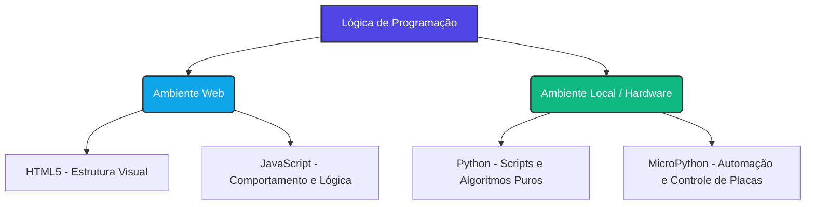

# 💻 Curso: Lógica de Programação Multilinguagem

## 📑 Visão Geral da Disciplina
Este curso apresenta os fundamentos da lógica de programação utilizando diferentes abordagens. O aluno aprenderá a estruturar o pensamento lógico criando interfaces visuais simples (HTML + JavaScript), processando dados em scripts locais (Python) e controlando hardware (MicroPython).

---

## 🗺️ Mapa de Ecossistemas Tecnológicos do Curso



---

## 📚 Cronograma e Conteúdo das Aulas

### 📝 Módulo 1: Fundamentos Universais e Web (HTML + JavaScript)
*   **Aula 01:** O que é lógica de programação e algoritmos? Variáveis e tipos de dados brutos.
*   **Aula 02:** **HTML5 Essencial:** Estruturação básica de páginas, tags de texto, inputs e botões.
*   **Aula 03:** Introdução ao **JavaScript**: Vinculando scripts ao HTML e manipulando o console.
*   **Aula 04:** Estruturas Condicionais no JavaScript (`if`, `else`, `switch`).
*   **Aula 05:** Estruturas de Repetição no JavaScript (`for`, `while`) e funções básicas.

### 📝 Módulo 2: Lógica Pura e Algoritmos com Python
*   **Aula 06:** Transição de sintaxe: Introdução ao **Python** (indentação obrigatória e tipagem dinâmica).
*   **Aula 07:** Operadores matemáticos e lógicos no Python (`and`, `or`, `not`).
*   **Aula 08:** Estruturas condicionais e laços de repetição em Python.
*   **Aula 09:** Estruturas de Dados Modulares: Listas, Tuplas e Dicionários em Python.
*   **Aula 10:** Modularização de código: Criação de funções com parâmetros e retorno de valores.

### 📝 Módulo 3: Lógica Aplicada ao Hardware com MicroPython
*   **Aula 11:** O que é **MicroPython**? Diferenças em relação ao Python convencional e ecossistema de microcontroladores.
*   **Aula 12:** Manipulação de saídas digitais em MicroPython: Lógica para ligar e desligar componentes (Acessando pinos GPIO).
*   **Aula 13:** Leitura de entradas digitais e analógicas: Lógica de varredura (*polling*) e leitura de sensores.
*   **Aula 14:** Eventos temporizados e controle de fluxo assíncrono básico em hardware (`time.sleep`).
*   **Aula 15:** Projeto Integrador Final: Conectando a lógica de software ao mundo real.

---

## 🔍 Paralelo de Sintaxe: O Mesmo Algoritmo em Diferentes Linguagens

### Problema: Verificar se um usuário é maior de idade (18 anos)

#### 🌐 Abordagem Web (HTML + JavaScript)
```html
<!-- Interface em HTML -->
<input type="number" id="idade" placeholder="Digite sua idade">
<button onclick="verificar()">Verificar</button>

<script>
// Lógica em JavaScript
function verificar() {
    let idade = Number(document.getElementById('idade').value);
    if (idade >= 18) {
        alert("Maior de idade");
    } else {
        alert("Menor de idade");
    }
}
</script>
```

#### 🐍 Abordagem Local (Python)
```python
# Lógica pura em Python via terminal
idade = int(input("Digite sua idade: "))

if idade >= 18:
    print("Maior de idade")
else:
    print("Menor de idade")
```

#### 🎛️ Abordagem de Hardware (MicroPython)
```python
# Lógica acendendo um LED físico se for maior de idade
from machine import Pin
import time

led_verde = Pin(2, Pin.OUT)
idade = 20  # Dado simulado vindo de uma leitura ou variável

if idade >= 18:
    led_verde.value(1)  # Liga o LED (Acesso permitido)
else:
    led_verde.value(0)  # Desliga o LED (Acesso negado)
```

---

## 🛠️ Ferramentas Recomendadas para as Aulas
*   **Editor de Código Geral:** VS Code ou Notepad++.
*   **Ambiente Web (HTML/JS):** Qualquer navegador moderno (Google Chrome, Firefox) utilizando a ferramenta de desenvolvedor (F12).
*   **Ambiente Python:** Thonny IDE (excelente para iniciantes), IDLE nativo ou terminal.
*   **Ambiente MicroPython:** Thonny IDE ou simulador virtual **Wokwi** (para testar sem componentes físicos).

---

## 📌 Critérios de Avaliação
*   **Exercícios Práticos de Fixação (Lógica Web e Python):** 40% da nota
*   **Desafios de Código em Laboratório/Simulador (MicroPython):** 30% da nota
*   **Projeto Integrador de Fim de Curso:** 30% da nota
