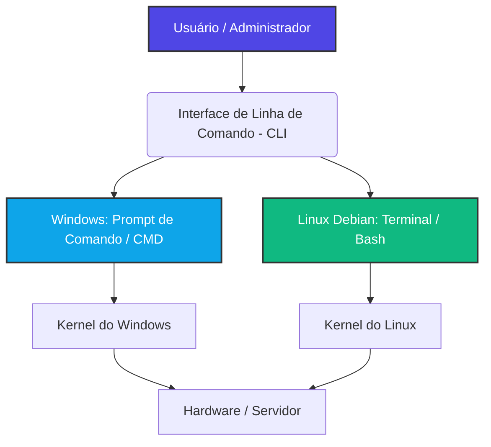

# 🐧💻 Curso: Sistemas Operacionais (SO)

## 📑 Visão Geral da Disciplina
Este curso aborda os fundamentos teóricos e práticos dos Sistemas Operacionais. Os alunos aprenderão a gerenciar processos, memória, usuários e sistemas de arquivos, comparando o ecossistema corporativo do Windows com a flexibilidade do Linux (focado na distribuição Debian) através de suas respectivas interfaces de linha de comando.

---

## 🗺️ Arquitetura de Operação: CLI (Linha de Comando)

---

## 📚 Cronograma e Conteúdo das Aulas

### 📝 Módulo 1: Fundamentos e Introdução aos Sistemas Operacionais
*   **Aula 01:** Introdução aos SOs: Evolução histórica, objetivos e funções do Kernel (Núcleo).
*   **Aula 02:** Arquitetura de Sistemas: Sistemas Monolíticos, Micronúcleos e Sistemas Híbridos.
*   **Aula 03:** Apresentação dos Ambientes: Estrutura comercial do Windows vs. Filosofia Open Source do Linux.
*   **Aula 04:** Instalação e Configuração de Ambiente: Criação de Máquinas Virtuais (VirtualBox) com Windows e Linux Debian.

### 📝 Módulo 2: Operação em Linha de Comando (Terminal e Prompt)
*   **Aula 05:** Introdução à CLI: Navegação básica de diretórios no Prompt do Windows (`cmd`) e no Terminal do Debian (`bash`).
*   **Aula 06:** Manipulação de Arquivos e Pastas: Criar, mover, copiar, renomear e excluir via comandos.
*   **Aula 07:** Gerenciamento de Usuários e Grupos: Criação de contas e controle de acessos via linha de comando.
*   **Aula 08:** Permissões de Arquivos: Segurança no Windows (ACLs) vs. Permissões Octais no Linux Debian (`chmod`, `chown`).

### 📝 Módulo 3: Gerenciamento Interno (Processos e Memória)
*   **Aula 09:** Gerenciamento de Processos: Ciclo de vida, estados de um processo e algoritmos de escalonamento.
*   **Aula 10:** Monitoramento de Processos na CLI: Identificação e finalização de tarefas (`tasklist`/`taskkill` no Windows vs. `ps`/`top`/`kill` no Debian).
*   **Aula 11:** Gerenciamento de Memória: Memória Virtual, Paginação, Segmentação e arquivos de paginação (*Swap* no Linux).

### 📝 Módulo 4: Sistemas de Arquivos e Administração Avançada
*   **Aula 12:** Sistemas de Arquivos: Estrutura e organização de dados (NTFS/FAT32 no Windows vs. EXT4 no Debian).
*   **Aula 13:** Gerenciamento de Pacotes e Programas: Instalação de softwares via CLI usando o gerenciador `APT` no Debian.
*   **Aula 14:** Automação de Tarefas Básicas: Introdução a scripts automatizados (Arquivos `.bat` no Windows e scripts `.sh` em Shell Script no Debian).
*   **Aula 15:** Projeto Prático: Auditoria e endurecimento de segurança (*Hardening*) de um servidor via linha de comando.

---

## 🔍 Guia de Referência Rápida: Prompt (Windows) vs. Terminal (Debian)

| Ação Operacional | 💻 Prompt de Comando (Windows) | 🐧 Terminal Bash (Linux Debian) |
| :--- | :--- | :--- |
| **Listar conteúdo do diretório** | `dir` | `ls -la` |
| **Navegar entre pastas** | `cd nome_da_pasta` | `cd nome_da_pasta` |
| **Criar uma nova pasta** | `mkdir nome_da_pasta` | `mkdir nome_da_pasta` |
| **Limpar a tela de comandos** | `cls` | `clear` |
| **Mostrar caminho atual** | `cd` | `pwd` |
| **Copiar arquivos** | `copy arquivo.txt destino\` | `cp arquivo.txt destino/` |
| **Mover/Renomear arquivos** | `move antigo.txt novo.txt` | `mv antigo.txt novo.txt` |
| **Excluir arquivos** | `del arquivo.txt` | `rm arquivo.txt` |
| **Mostrar processos ativos** | `tasklist` | `ps aux` ou `top` |
| **Exibir configurações de rede**| `ipconfig` | `ip a` ou `ifconfig` |

---

## 🛠️ Ferramentas Recomendadas para Laboratório
*   **Hipervisor / Virtualização:** Oracle VirtualBox ou VMware Workstation Player.
*   **Imagens de Sistemas (ISOs):** Debian GNU/Linux (versão estável Netinst) e Windows 10/11 ou Windows Server.
*   **Acesso Remoto:** OpenSSH Client/Server para conexões de terminal remoto via PuTTY.

---

## 📌 Critérios de Avaliação
*   **Desafios Práticos de Linha de Comando (Laboratórios):** 40% da nota
*   **Testes Teóricos de Arquitetura (Processos e Memória):** 30% da nota
*   **Projeto Final de Administração de Servidores (Scripts/Automação):** 30% da nota
